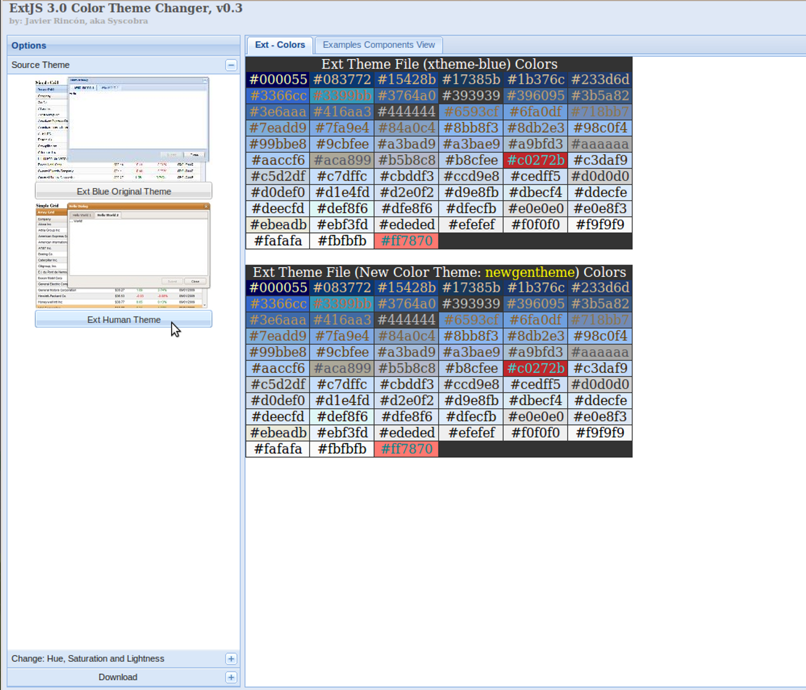
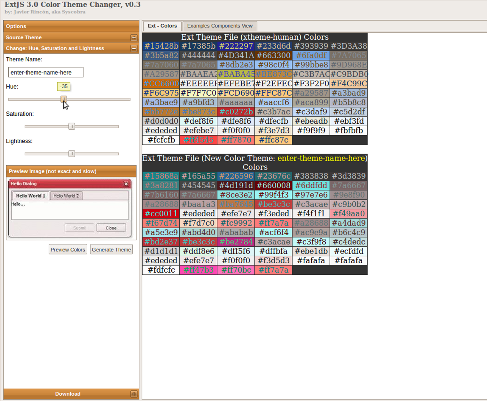

# RNASeq Application Screens

## Custom Theme 

We currently using this tools from this site : http://playground.ideashs.com/themescolor/ (**ExtJS 3.0 Color Theme Changer, v0.3** by: Javier Rincón, aka Syscobra) to create different custom color theme.

Here is the step how to use the tools :
First, go to http://playground.ideashs.com/themescolor/
Select the **Source Theme** ( Ext Blue Original Theme or Ext Human Theme)

Click to the menu -> **Change : Hue, Saturation and Lightness**
Play around with the Hue/Saturation/Lightness and view the theme in panel **Preview Image(not exact or slow)**
Press "**Preview Colors**". You will see a palette of colors to compare with the original from Ext.
After that, enter your prefer **Theme Name** and click "**Generate Theme**".

Then, click "**Examples Components View**" tab to view the new custom theme components.
Click "**xtheme-enter-theme-name-here...**" to download the theme in zip format.

After downloaded, extract the zip file, you will get a resources folder that contain two folders called "css" and "images". 
Copy the folder inside "images" into our framework under "/var/www/frame/framework/extjs/resources/images/" and copy the css file inside "css" into our framework under "/var/www/frame/framework/extjs/resources/css/".
Then, change the css link name/location in "framework.php" from old to new custom theme name/location.
View framework in browser or refresh the framework.

This is example zip file that created : http://dev.novocraft.com/projects/trac1/attachment/wiki/appscreen/newgentheme.zip

## Result Viewing
Users that complete alignment and per-experiment file creation need to do various operations on the workflow results to view their data output.

 * [RNA-Seq](http://dev.novocraft.com/trac/trac_backup/wiki/rnaseqviews)
 * [Target Files View](http://dev.novocraft.com/trac/trac_backup/wiki/targetViews)

## Example software
**Tbrowse**: An ExtJS-based browser for transcriptome data. The code is available but there is no stable release yet. Have a look at the video.
http://code.google.com/p/tbrowse/ 
http://www.youtube.com/watch?v=eEkCCfD9b3Y

Dictyexpress: http://www.ailab.si/dictyexpress/run/index.php?username=rnaseq&password=rnaseq browser

See my  working [prototype skeleton]([http://172.20.20.122/), and you may find the sourcecode [here](http://nfs1.local/websvn/listing.php?repname=Development+Code&path=%2Frnaseq_spec%2Fwebviews%2F#) or in sv at

```{r kable}
Path: .
URL: svn+ssh://nfs1.local/dsk1/repositories/svn/devcode/rnaseq_spec
Repository Root: svn+ssh://nfs1.local/dsk1/repositories/svn/devcode
Repository UUID: 4417746c-2ea1-4b1d-a715-c69377f121be
Revision: 45
Node Kind: directory
Schedule: normal
Last Changed Author: zayed
Last Changed Rev: 45
Last Changed Date: 2010-02-24 13:07:57 +0800 (Wed, 24 Feb 2010)
```


